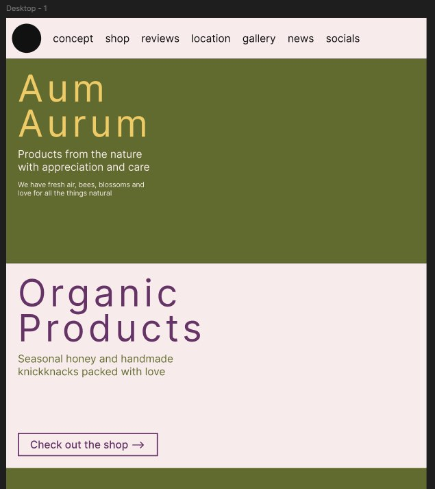
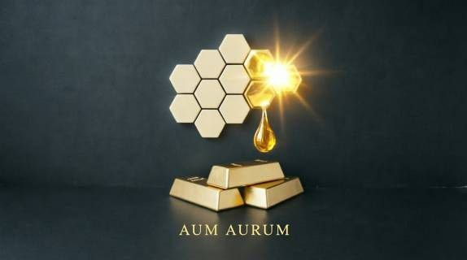

# Aum Aurum — бриф сайта-визитки

> Семейная пасека в селе Навази (Мцхета, Грузия): мёд, пчелосемьи, ульи на заказ.
> Этот файл — единый источник правды для будущего сайта. Всё, что помечено **⚠ согласовать**, — мои предложения, которые ещё не утверждены.
> Статусы: ✅ есть · 🟡 есть черновик · ❌ нужно собрать.

Версия 0.5 · 2026-10-04 · изменения: утверждён стиль (п. 13), старые п. 6–7 заменены

---

## 1. Что уже есть

| # | Материал | Источник | Статус |
|---|----------|----------|--------|
| 1 | Название **Aum Aurum** | черновик сестры | ✅ |
| 2 | Направления: мёд (основное), пчелосемьи, ульи | семья | ✅ |
| 3 | Локация: с. Навази, Мцхетский муниципалитет, Грузия | семья | ✅ |
| 4 | Языки сайта: грузинский, русский, английский | семья | ✅ |
| 5 | Референс вёрстки — [pottery1.com](https://pottery1.com/) | сестра | ✅ |
| 6 | Палитра из 5 цветов | [coolors](https://coolors.co/111111-efcb68-626b2f-663366) + `#F7EBEC` | ✅ |
| 7 | Список разделов (7 шт.) | сестра | ✅ |
| 8 | Первый макет (hero + «Organic Products») | [assets/draft-v0-sister.png](assets/draft-v0-sister.png) | 🟡 |
| 9 | Тексты (hero, магазин) — только EN | макет | 🟡 |
| 10 | Логотип | 3D-рендер, [assets/logo-v0-render.png](assets/logo-v0-render.png), разбор в п. 6.4 | 🟡 |
| 11 | Фото, товары, цены, контакты, отзывы, переводы | — | ❌ |

---

## 2. Бизнес

### 2.1 Направления (подтверждены)

| Направление | Роль | Кому | Сезон |
|-------------|------|------|-------|
| 🍯 **Мёд** | основное, приносит главный доход | туристы с трассы, жители Тбилиси/Мцхеты, подарки | сбор летом, продажа круглый год |
| 🐝 **Пчелосемьи** | дополнительное | начинающие и действующие пчеловоды Грузии | предзаказ зимой, выдача весной — в начале лета |
| 🏠 **Ульи на заказ** | дополнительное | пчеловоды, фермеры, любители | изготовление круглый год, пик спроса — зима и весна |

### 2.2 Расширение ассортимента ⚠ согласовать
Мои предложения: что естественно вырастает из того, что у вас уже есть. Отметьте, что реально, а что нет.

**Продукты пчеловодства (к мёду)**
- Мёд в сотах, рамки с сотами. Хорошо выглядят на фото и в подарок.
- Прополис (кусочком или настойкой), перга, пыльца, воск.
- Подарочные наборы: 3 маленькие баночки разных сортов + сота + деревянная ложка, упаковка с логотипом. Подходит туристам «увезти домой».
- Handmade из воска: свечи, вощина. Это те самые «knickknacks» из макета сестры.
- Сорта мёда пишем только реальные: разнотравье, липа, акация, горный… ❌ уточнить у родителей.

**Пчелосемьи**
- Отводки/нуклеусы (на 3–5 рамках) и полные семьи.
- Плодные матки (если выводите сами).
- **Порода — сильный аргумент для продаж.** Грузинская серая горная пчела (*Apis mellifera caucasica*) известна во всём мире, прежде всего длинным хоботком. Если у вас она, это надо писать крупно. ❌ уточнить.
- Предзаказ с предоплатой и календарём «когда можно забрать».

**Ульи**
- Каталог моделей, например Дадан и Лангстрот (❌ какие делаете), корпуса, рамки, нуклеусные ящики, дно, крышки.
- Опции: материал, покраска/пропитка, количество корпусов.
- «Сделано своими руками на пасеке, проверено на своих пчёлах» — это главное отличие от магазинных ульев.

**Комбинированные предложения (связывают все три направления)**
- **«Старт пчеловода»:** улей + пчелосемья + 1–2 консультации или выезд. Такой пакет может продавать только тот, кто делает и ульи, и семьи. ⭐ на мой взгляд, лучшая идея из списка.
- Консультации и помощь начинающим, ловля и снятие роёв.
- Аренда семей фермерам для опыления садов.

**Апитуризм (использует расположение на трассе, см. п. 3)**
- «Остановка на пасеке»: 30–45 минут, дегустация 3–5 сортов, посмотреть ульи через стекло или в защитной одежде, купить мёд с собой.
- Мастер-класс по свечам из вощины (для детей и семей).
- Позже, если пойдёт: «апидомик» (отдых на ульях), фото-зона. ⚠ без медицинских обещаний в текстах.

**B2B**
- Мёд и подарочные наборы для гестхаусов, отелей и ресторанов по дороге на Гудаури/Казбеги, корпоративные подарки.

**Подписка «Своя семья» / Adopt a hive** (на будущее)
- Человек «усыновляет» улей: получает фото и новости своей семьи и часть мёда урожая. Хорошо работает с диаспорой и туристами, которые уже уехали.

### 2.3 История для раздела Concept
В 2003 году под Боржоми (с. Сакире) археологи нашли в древнем захоронении следы мёда. Ему около 5 500 лет, это старейший известный мёд в мире. Подробнее: [Eurasianet](https://eurasianet.org/report-georgia-unearths-the-worlds-oldest-honey), [CBW](https://cbw.ge/economy/world-bee-day-celebrated-in-borjomi-with-focus-on-georgias-ancient-beekeeping-heritage).

Это прямая параллель с блоком референса «HISTORY LESSON — 5,000 years of clay»: у нас будет **«HISTORY LESSON — 5,500 years of Georgian honey»**, а дальше переход к истории вашей семьи.

---

## 3. Локация

- **Адрес:** с. Навази (ნავაზი / Navazi), Мцхетский муниципалитет, край Мцхета-Мтианети. Координаты села ≈ 41.982, 44.741 ([OpenStreetMap](https://www.openstreetmap.org/?mlat=41.9818&mlon=44.7410#map=14/41.9818/44.7410)).
- **Расстояния:** по прямой ~15 км от Мцхеты и ~30 км от центра Тбилиси (❌ уточнить, сколько по дороге).
- **Главное преимущество:** село стоит на трассе **Мцхета — Степанцминда — Ларс (Военно-Грузинская дорога)**. Это основной туристический маршрут: Ананури, Жинвали, Гудаури, Казбеги. Мимо круглый год едут туристы и жители Тбилиси.

**Что это значит для сайта ⚠ согласовать**
- Раздел Location становится не просто картой, а «Visit us»: «Заезжайте по пути в Казбеги». Кнопка «Маршрут в Google Maps» строит путь прямо из телефона.
- Нужна **карточка в Google Maps** («Aum Aurum — Honey & Apiary»), сайт будет ссылаться на неё. Многие туристы найдут вас именно через карты, а не через поиск.
- На трассе стоит поставить указатель с QR-кодом, который ведёт на сайт или в мессенджер.
- ❌ Уточнить: где ведёте продажу — у дома, у дороги или на самой пасеке? Можно ли приехать без звонка? Часы работы?

---

## 4. Три языка: ქართული · Русский · English

### 4.1 Как устроено ⚠ согласовать
- Отдельные адреса для каждого языка: `/ka/`, `/ru/`, `/en/`. Это нужно, чтобы Google находил каждую версию.
- Переключатель в шапке: `ქარ · РУС · ENG`.
- **Язык по умолчанию:** определять по языку браузера, а если язык не определён — английский. Тогда туристам сразу показывается EN/RU, а грузинам — KA.
- В админке у каждого текста, товара и новости три поля: KA / RU / EN. Если перевода нет, показываем английскую версию, страница не будет пустой.
- **Переводы:** черновики RU/EN/KA могу подготовить я, но грузинский текст **обязательно вычитывает носитель языка** перед публикацией.

### 4.2 Подводные камни грузинского языка (учтём при вёрстке)
- **У Inter, шрифта из макета, нет грузинских букв.** Для грузинского нужен отдельный шрифт (см. п. 6).
- В грузинском обычно нет заглавных букв. А «брови» и меню у референса набраны КАПСОМ, и для грузинского CSS может превратить такой текст в буквы Мтаврули, которых нет во многих шрифтах. Решение: для `ka` убираем КАПС и выделяем «брови» цветом и разрядкой.
- Грузинские слова длиннее английских: «მდებარეობა» вместо «location». Огромные заголовки hero и меню надо проверить на всех трёх языках, на телефоне особенно.
- Логотип «Aum Aurum» оставляем латиницей во всех языках, это бренд.

### 4.3 Пункты меню (черновик, KA — проверить носителю)

| EN | RU | KA |
|----|----|----|
| concept | о нас | ჩვენ შესახებ |
| shop | магазин | მაღაზია |
| gallery | галерея | გალერეა |
| reviews | отзывы | შეფასებები |
| news | новости | სიახლეები |
| location | как добраться | მდებარეობა |
| socials | контакты | კონტაქტი |

---

## 5. Тексты

Сохраняю тексты из черновика дословно, а мои правки идут отдельной колонкой.

| Где | Сейчас (EN) | Предложение ⚠ согласовать |
|-----|-------------|---------------------------|
| Hero, заголовок | Aum Aurum | без изменений |
| Hero, подзаголовок | Products from the nature with appreciation and care | Honey, bees and hives **from Navazi, Georgia** — made with appreciation and care |
| Hero, абзац | We have fresh air, bees, blossoms and love for all the things natural | We have fresh mountain air, bees, blossoms and a love for all things natural |
| Магазин, заголовок | Organic Products | **Natural Products** (п. 8.1) |
| Магазин, подзаголовок | Seasonal honey and handmade knickknacks packed with love | без изменений |
| Магазин, кнопка | Check out the shop → | без изменений |

Подзаголовок hero на трёх языках (черновик):
- **EN:** Honey, bees and hives from Navazi, Georgia — made with appreciation and care
- **RU:** Мёд, пчёлы и ульи из Навази — с заботой и уважением к природе
- **KA:** თაფლი, ფუტკარი და სკები ნავაზიდან — ზრუნვით და ბუნების პატივისცემით *(проверить носителю)*

---

## 6. Визуальный стиль

> ⛔ **Устарело.** Палитра, шрифты и вёрстка по pottery1.com из этого раздела заменены утверждённым стилем — см. **п. 13** и DESIGN.md. Логотип (п. 6.4) остаётся в силе, слитки сохраняем.

### 6.1 Референс: что берём у pottery1.com
Сайт построен как **одна длинная страница**: секции идут друг за другом, меню прокручивает к нужной. Повторяем такие приёмы:

- **Шапка:** круглый логотип слева, рядом пункты меню, шапка закреплена сверху. У нас справа ещё переключатель языка.
- **Hero:** огромный заголовок слева, под ним подзаголовок и абзац. Справа **«полароиды» на верёвочке с прищепками**, самый узнаваемый приём референса.
- **«Бровь»** над каждым H2: мелкая подпись акцентным цветом (`OUR STORY`, `HISTORY LESSON`).
- **Две колонки:** слева заголовок, справа текст. Есть вариант «текст и мозаика фото».
- **Полоса фактов** с вертикальными разделителями.
- **Ряд карточек:** фото, заголовок и 1–2 строки (у них «Private events»). У нас так выглядят три направления бизнеса.
- **Лента тегов** через точки-разделители.
- **Тёмные полосы** между светлыми секциями.
- **Отзывы:** крупная цифра и кнопка «Read all →».
- **Галерея:** плотная мозаика фото.
- **«LET'S TALK.»:** крупный заголовок, рядом колонки контактов со стрелками.
- **Стиль:** тёплый светлый фон, один акцент, контурные кнопки со стрелкой `→` (у сестры такие уже есть ✅), много воздуха.

### 6.2 Палитра

| Токен | HEX | Название | Роль ⚠ согласовать |
|-------|-----|----------|---------------------|
| `blush` | `#F7EBEC` | Лавандовый румянец | основной фон |
| `ink` | `#111111` | Почти чёрный | текст, тёмные полосы, футер |
| `olive` | `#626B2F` | Оливковый мох | фон hero и «природных» секций, вторичный текст на светлом |
| `plum` | `#663366` | Слива | заголовки на светлом, кнопки, ссылки |
| `honey` | `#EFCB68` | Медовый | акцент: заголовки на тёмном/оливковом, «брови», линии |

**Контраст (WCAG), я посчитал каждую пару:**

| Текст / фон | Контраст | Можно? |
|-------------|----------|--------|
| ink / blush | 16.2 | ✅ любой текст |
| ink / honey | 12.1 | ✅ любой (кнопка с медовой заливкой) |
| plum / blush | 8.1 | ✅ любой |
| honey / plum | 6.0 | ✅ любой |
| blush / olive | 4.9 | ✅ обычный текст |
| olive / blush | 4.9 | ✅ обычный текст |
| honey / olive | 3.7 | ⚠ только крупный (от 24px) |
| ink / olive | 3.3 | ⚠ только крупный |
| ink / plum | 2.0 | ❌ |
| olive / plum | 1.6 | ❌ |
| honey / blush | 1.35 | ❌ **никогда** |

### 6.3 Шрифты ⚠ согласовать
Шрифт должен поддерживать **грузинский, кириллицу и латиницу**. В Google Fonts грузинский есть только у нескольких семейств (Noto Sans Georgian, Noto Serif Georgian), поэтому строим пару шрифтов. Браузер сам берёт грузинские буквы из второго шрифта.

| Вариант | Латиница + кириллица | Грузинский | Характер |
|---------|----------------------|------------|----------|
| **B** (как у сестры) ⭐ | Inter Light, широкая разрядка | Noto Sans Georgian Light | легко, спокойно, премиально |
| A (ближе к референсу) | Oswald, капс | Noto Sans Georgian Bold | энергично; но узкого грузинского аналога нет, языки будут смотреться по-разному |
| C (тёплый) | Fraunces | Noto Serif Georgian | уютно, «натурально» |
| D (один шрифт на всё) | FiraGO | FiraGO | все три алфавита в одном шрифте (бесплатный, но не из Google Fonts) |

**Рекомендация:** **B**. Сохраняется находка сестры, а Inter и Noto Sans Georgian похожи по характеру, поэтому все три языка будут смотреться одинаково.

Шрифт в логотипе — классическая антиква капсом в «римском» духе, он сочетается с латинским «Aurum». Сайту это не мешает: надпись в логотипе — картинка, а пара «антиква в логотипе + гротеск на сайте» классическая.

### 6.4 Логотип

**Что получилось хорошо**
- Идея читается сразу: соты, одна золотая ячейка и капля мёда. «Aurum» по-латыни значит «золото», то есть логотип визуально объясняет название.
- Надпись AUM AURUM антиквой капсом с разрядкой выглядит благородно и подходит бренду.

**Почему это пока не логотип для сайта, а «обложка»**

| Проблема | Почему важно |
|----------|--------------|
| Это картинка 574×320 px, а не векторный файл | на телефонах с чётким экраном будет размыто, крупно не увеличить |
| Логотип — сцена с тёмным фоном, бликами и тенями | нельзя поставить на розовый или оливковый фон сайта, кругом в шапку, на банку или визитку |
| При уменьшении до иконки вкладки (32 px) или круга в шапке (48 px) | слитки и свечение превращаются в пятно |
| Цвета не из палитры: фон `#323F45` (сине-серый), соты кремовые, золото металлическое | на сайте будет выглядеть «чужим» |
| ⚠ **Золотые слитки** | у многих вызывают ассоциации «инвестиции / золото / крипто», а не «мёд». Семейной пасеке нужно доверие, а не финансовый блеск. Предлагаю убрать слитки из знака и оставить соты с каплей |

**Предложение ⚠ согласовать:** я рисую векторную систему логотипа (SVG) на основе этой идеи:

| Версия | Что | Где используется |
|--------|-----|------------------|
| Знак | 7–9 сот, одна ячейка медовая (`honey`), из неё капля | везде |
| Горизонтальная | знак + AUM AURUM в одну строку | шапка на компьютере, документы |
| Вертикальная | знак над надписью | футер, этикетки, визитки |
| Круглый бейдж | знак в круге | шапка (как круг в макете сестры), аватарки соцсетей |
| Иконка | одна медовая ячейка с каплей | иконка вкладки, иконка на телефоне |
| Монохром | `ink` на светлом / `blush` на тёмном | штампы, гравировка на ульях, ч/б печать |

Нынешний 3D-рендер не выбрасываем: он хорош как атмосферная картинка для обложки соцсетей, заставки в «О нас» или подарочной упаковки.

❌ Уточнить: есть ли исходник в большем размере и кто/чем его сделал (если генерация — какой сервис, чтобы понимать права на использование)?

---

## 7. Структура сайта

> ⛔ **Устарело.** Новый набор и порядок разделов — в **п. 13**.

### 7.1 Главная страница — порядок секций ⚠ согласовать
Разделы сестры сохраняю, новые направления распределяю внутрь них:

| # | Секция | Меню | Фон | Аналог у референса |
|---|--------|------|-----|--------------------|
| 0 | Hero | — | olive | Hero с полароидами |
| 1 | **Concept** | concept | blush | History lesson + Our concept |
| 2 | **Shop** — три направления | shop | blush | Private events (ряд карточек) |
| 3 | **Gallery** | gallery | ink | Made in just one class |
| 4 | **Reviews** | reviews | plum | 20,000+ reviews |
| 5 | **News** | news | blush | Blog |
| 6 | **Location / Visit us** | location | olive | Network of local studios |
| 7 | **Socials / Let's talk** | socials | ink | Let's talk + Footer |

### 7.2 Отдельные страницы (помимо главной)
- `/shop/honey`: мёд и продукты пчеловодства, подарочные наборы.
- `/shop/bee-colonies`: пчелосемьи, отводки, матки, предзаказ.
- `/shop/hives`: модели ульев и комплектующие, «Старт пчеловода».
- `/news/<статья>`: страница каждой новости.
- `/visit`: экскурсии и дегустации (если делаем апитуризм).

### 7.3 Секции подробно

#### 0. Hero
- **Контент:** «Aum Aurum» (honey на olive) + подзаголовок с географией + абзац (п. 5).
- **Вёрстка:** справа 3–4 полароида на верёвке: пчёлы на рамке, банка мёда в руках, ульи на фоне гор, мастерская с ульями.
- **Нужно:** ❌ 4 вертикальных фото, ❌ логотип.

#### 1. Concept — о нас
- **Блок 1:** «бровь» `HISTORY LESSON` и заголовок «5,500 years of Georgian honey» с коротким рассказом про находку в Сакире (п. 2.3).
- **Блок 2:** «бровь» `OUR FAMILY`, история вашей пасеки, мозаика фото.
- **Полоса фактов** (❌ заполнить реальными), пример:
  `FAMILY APIARY | NAVAZI, GEORGIA | SINCE 20XX | XX HIVES | CAUCASIAN GRAY BEE | HIVES MADE BY HAND`
- **Нужно:** ❌ история семьи (3–5 абзацев), ❌ 4–6 фото, ❌ 4–6 фактов.

#### 2. Shop — три направления
- **Заголовок:** «Natural Products», подзаголовок, кнопка.
- **Ряд из 3 крупных карточек**, как «Private events» у референса:

| Карточка | Текст (EN, черновик) | Кнопка |
|----------|----------------------|--------|
| 🍯 Honey | Seasonal honey, honeycomb and bee products from our apiary | Shop honey → |
| 🐝 Bee colonies | Strong, healthy colonies and nucs — spring pre-order | Pre-order → |
| 🏠 Hives | Handmade hives built and tested on our own apiary | Order a hive → |

- Под карточками баннер **«Start beekeeping with us»**: улей + семья + консультация (⚠ если делаем пакет).
- **Сезонная лента** (тот же приём, что лента тегов у референса): `JUNE–AUGUST: HONEY HARVEST · APRIL–MAY: COLONIES · ALL YEAR: HIVES` (❌ уточнить реальные месяцы).
- **Как принимаем заказы:** см. п. 8.2.

#### 3. Gallery
- Мозаика на тёмном фоне, по клику фото открывается крупно. Фото по сезонам: весна (облёт), лето (сбор), осень, зима (мастерская).
- **Нужно:** ❌ 12–24 фото.

#### 4. Reviews
- Крупная цифра или рейтинг, 3–6 карточек-цитат (на языке оригинала, с пометкой языка), кнопка «Read all →» на Google Maps.
- **Нужно:** ❌ отзывы и разрешение авторов на публикацию.

#### 5. News
- Три последние новости карточками. Темы: «сбор 2026 начался», «открыт предзаказ пчелосемей на весну», «новая модель улья», «нас можно найти на ярмарке».
- Новость можно опубликовать на одном языке, перевод добавить позже.
- **Нужно:** ❌ 2–3 стартовые новости.

#### 6. Location / Visit us
- Слева заголовок «Visit us on the road to Kazbegi». Справа карта или иллюстрированная схема трассы Тбилиси → Мцхета → **Навази** → Ананури → Гудаури → Казбеги, на ней 2–3 полароида: пасека, точка продаж, дегустация.
- Под картой: адрес, часы, кнопка «Маршрут в Google Maps», условия визита («позвоните заранее»).
- **Нужно:** ❌ точка продаж (точные координаты), ❌ часы, ❌ правила визита.

#### 7. Socials / «Let's talk»
- **Заголовок:** «LET'S TALK.»
- **Колонки по направлениям:** «Honey orders», «Colonies & hives», «Visits & partners» → имя, телефон, мессенджер.
- **Иконки:** WhatsApp, Telegram, Viber, Facebook, Instagram (❌ какие используете; в Грузии очень популярен Facebook).
- **Футер:** тёмный, копирайт, адрес, переключатель языка.

---

## 8. Мои предложения и риски ⚠ согласовать

### 8.1 Слово «Organic»
«Organic» и «ბიო» на продуктах — это сертифицируемая маркировка: в ЕС точно, в Грузии надо проверить отдельно, особенно если будет экспорт. Без сертификата безопаснее писать **Natural / Raw / Pure honey from our family apiary**. Если сертификат есть, оставляем «Organic» и показываем значок.

### 8.2 Заказы: заявка или онлайн-оплата
- **Старт (рекомендую):** каталог с ценами. Кнопка «Заказать» открывает форму или WhatsApp/Telegram с уже заполненным текстом («Хочу: липовый мёд 1 кг»). Заявка с сайта приходит вам в мессенджер.
- **Пчелосемьи:** форма предзаказа (количество, тип, когда забрать, телефон), предоплату договариваете лично.
- **Ульи:** форма «рассчитать улей» (модель, опции, количество).
- **Позже:** онлайн-оплата через эквайринг грузинского банка, если заказов станет много.

### 8.3 Юридическое (проверить, не блокирует сайт)
- Продажа мёда и пчелосемей: какие регистрации и ветеринарные документы нужны в Грузии (Национальное агентство продовольствия). Если документы есть, это стоит показать на сайте, это укрепляет доверие.
- Отзывы и фото людей: публикуем только с их согласия.
- Политика конфиденциальности: формы собирают телефоны, нужна короткая страница.

### 8.4 Требования к будущему сайту (для следующего шага)
- Вы с сестрой сами правите тексты, товары, цены, наличие семей, новости, фото и отзывы **без программиста**, на трёх языках.
- Сайт отлично работает на телефоне: туристы на трассе почти всегда с телефона.
- Быстрая загрузка: фото сжимаются автоматически.
- SEO на трёх языках, разметка «местный бизнес» для Google Maps.
- Домен: `.ge` или `.com`, например `aumaurum.ge` / `aumaurum.com` (❌ проверить, свободен ли).
- Хостинг дешёвый или бесплатный. Стек выберем на следующем шаге.

---

## 9. Чек-лист контента

- [x] Логотип: идея есть (рендер). Осталось: векторная версия (п. 6.4)
- [ ] 4 фото для hero
- [ ] История семьи + 4–6 фактов + 4–6 фото
- [ ] **Мёд:** сорта, объёмы тары, цены, фото
- [ ] **Пчелосемьи:** порода, формат (отводок/семья), цена, сроки, условия предоплаты, фото
- [ ] **Ульи:** модели, опции, цены, сроки изготовления, фото из мастерской
- [ ] Доставка / самовывоз / оплата
- [ ] 12–24 фото для галереи
- [ ] 3–6 отзывов + разрешения
- [ ] 2–3 стартовые новости
- [ ] Точка продаж на карте, часы, правила визита
- [ ] Телефоны, мессенджеры, соцсети
- [ ] Носитель грузинского для вычитки переводов
- [ ] Домен

---

## 10. Открытые вопросы

1. **Расширение ассортимента (п. 2.2):** что из списка реально? Особенно «Старт пчеловода», апитуризм и продукты пчеловодства.
2. **Порода пчёл:** серая горная кавказская?
3. **Ульи:** какие модели делаете?
4. **Где продаёте:** у трассы, у дома, на пасеке? Можно ли приезжать?
5. **Язык по умолчанию:** по браузеру с запасным английским (п. 4.1) — ок?
6. **Кто вычитывает грузинский?**
7. **Порядок секций (п. 7.1)** и **шрифт (п. 6.3)**: принимаем B?
8. **Organic:** есть ли сертификат?
9. **Заказы:** начинаем с заявок в мессенджер (п. 8.2)?
10. **Логотип:** рисуем векторную версию без слитков (п. 6.4)?
11. **Кто будет обновлять сайт** и как часто?

---

## 11. Готовность к старту реализации

> **Решено 2026-10-04:** вариант **A** (код + админка). Логотип рисуем в векторе, **слитки оставляем**. Контент старт не блокирует. Хостинг и Telegram-бот подключаем позже.

### 11.1 Решения, которые блокируют старт

**1. На чём делаем сайт ⚠ согласовать**

| | **A. Код + админка** ⭐ | B. Конструктор Tilda |
|---|---|---|
| Что это | Astro (быстрый сайт) + Sveltia CMS (админка по адресу `/admin`) + хостинг Cloudflare Pages | визуальный конструктор, на нём сделан сам референс pottery1.com |
| Кто делает | я пишу весь код, вы правите контент в админке | вы с сестрой собираете сами мышкой, я подсказываю |
| Три языка | нормально: одна страница с полями KA/RU/EN | слабо: на каждый язык отдельная копия страницы, изменения дублируются руками |
| Свобода дизайна | любая, всё из брифа реализуемо | в рамках блоков конструктора |
| Правки дизайна потом | через меня (код) | сами |
| Стоимость | хостинг 0 ₾, только домен (~$10–40/год) | подписка ~$10–20/мес + домен |
| Скорость и SEO | максимум | хорошо |

**Рекомендация:** **A**. Три языка и тонкая вёрстка — сильная сторона кода. Контент (товары, новости, фото, цены, наличие пчелосемей) вы правите сами в админке без программиста.

**2. Логотип:** утвердить, что рисую вектор (п. 6.4). Можно параллельно с вёрсткой.

**Остальное** (шрифт B, порядок секций, язык по умолчанию, заказы через мессенджер) я могу взять по умолчанию из брифа, поменять потом легко.

### 11.2 Аккаунты (создаёте вы — я аккаунты не создаю и пароли не ввожу)

| Аккаунт | Зачем | Когда |
|---------|-------|-------|
| **GitHub** (вам и сестре) | хранит код сайта; через него вход в админку | до старта |
| **Cloudflare** | бесплатный хостинг; там же можно купить домен `.com` по себестоимости | к первой публикации |
| **Домен** | `aumaurum.ge` (через грузинского регистратора) или `.com` (Cloudflare) | к публикации |
| **Telegram-бот** или e-mail | куда приходят заявки с сайта | к публикации |
| **Google Business Profile** | карточка пасеки в Google Maps | можно сразу, не зависит от сайта |

### 11.3 Контент: не блокирует

Начинаю с аккуратных заглушек, вы заменяете их в админке по мере готовности. **Минимум к публикации:** вектор логотипа, контакты, список товаров с ценами, 10–15 фото, история семьи, грузинские тексты, вычитанные носителем.

### 11.4 Техническое (готово)
- ✅ Node.js 24, npm 11, git установлены
- ✅ Скилл дизайна **impeccable 4.5.0** установлен (`~/.claude/skills/impeccable`, версия закреплена)
- Папка проекта: `C:\Sites\aum-aurum` (git-репозиторий), бриф переедет туда

---

## 12. Статус реализации (2026-10-04)

**Сделано (этап 1)**
- Проект Astro + Sveltia CMS в этой папке, git пока не подключён (решение пользователя, подключим позже).
- Главная страница на трёх языках: все 8 секций, заглушки вместо фото, примеры новостей помечены «пример».
- Страницы новостей (`/<язык>/news/`), выбор языка, SEO-основа (hreflang, описание, разметка LocalBusiness).
- Векторный логотип (вариант на чёрном, слитки оставлены): `assets/logo/aum-aurum-logo-black.svg`, знак, иконка вкладки.
- Конфиг админки: тексты главной, товары, новости, контакты, отзывы, галерея — всё с полями KA/RU/EN.

**Отклонения от брифа**
- «Брови» (мелкие подписи над заголовками) убраны: заголовки читаются сами, а для грузинского капс всё равно не подходит. Если нужны — вернём.
- Карточки магазина неравные: мёд — большая медовая карточка с прайсом, пчелосемьи и ульи — две меньшие (мёд — основное направление).

**Дальше:** см. CLAUDE.md → Next steps.

---

## 13. Утверждённый стиль (2026-10-04)

После трёх демо (A «Крашеный улей», B «Дорога на Казбеги», C «Мир логотипа») семья взяла из каждого лучшее. Итог — **демо D**: [demos/d-combined.html](demos/d-combined.html). Подробная дизайн-система — в [DESIGN.md](DESIGN.md).

**Разделы и порядок:**

| # | Раздел | Фон | Что внутри |
|---|---|---|---|
| 1 | Home | чёрный | логотип, AUM AURUM шрифтом логотипа, кнопки, анимация пасеки, «5 500 лет» |
| 2 | Shop | бежевый | товары в виде пчелиных рамок: мёд (с прайсом), пчелосемьи, ульи + «Старт пчеловода» |
| 3 | Location | чёрный | ночная гора с луной, дорога Тбилиси → **Навази** → Казбеги, кнопка маршрута |
| 4 | News | бежевый | список новостей |
| 5 | Reviews | чёрный | отзывы |
| 6 | Gallery | бежевый | полароиды на верёвочках |

**Ключевые решения:**
- В шапке только знак логотипа, без надписи (она уже есть в первом экране).
- Анимация пасеки: пять разноцветных ульев с медными крышками, летают пчёлы; при наведении (на телефоне — нажатии) крышка поднимается и вылетает рой.
- Полоса прокрутки: пунктир слева, по нему летит пчела, смотрит туда, куда листают.
- Шрифты: Cinzel — только надпись AUM AURUM; Forum — заголовки и кнопки; PT Serif — текст; для грузинского — Noto Serif Georgian.
- Золото — только на тёмном фоне; на бежевом даты и ссылки винно-красные.
- Прежний стиль (розовый/оливковый/сливовый, Inter, вёрстка pottery1.com) больше не используется.

**Статус:** стиль утверждён, рабочий сайт в `src/` пока в старом виде — следующий шаг: перенести в него стиль D (три языка, админка, новые разделы).
